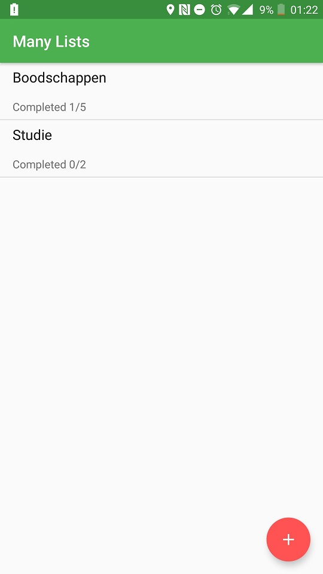
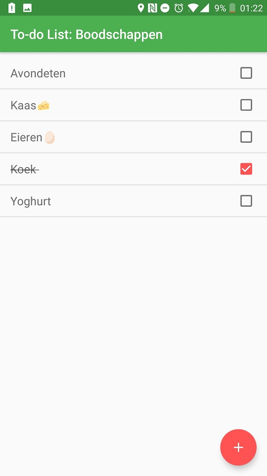
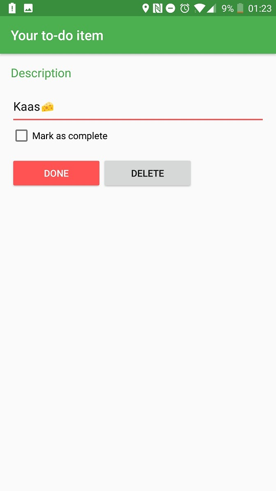

# Many Lists

Native App Studio - Project 5

By Sebastiaan Joustra

An extension to the previous to-do app. Now allows the user to create lists containing separate to-do items.

## How to run

Open in Android Studio and run on a Android device with 7.0 or higher.

### Screenshots

